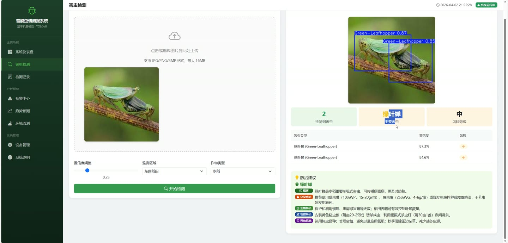
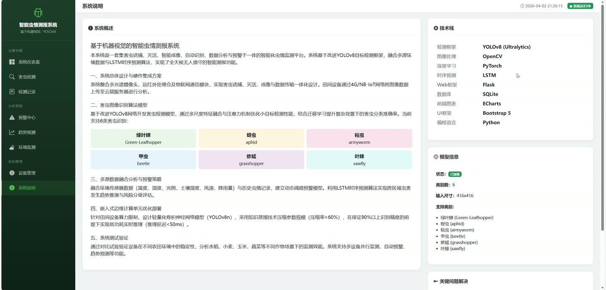
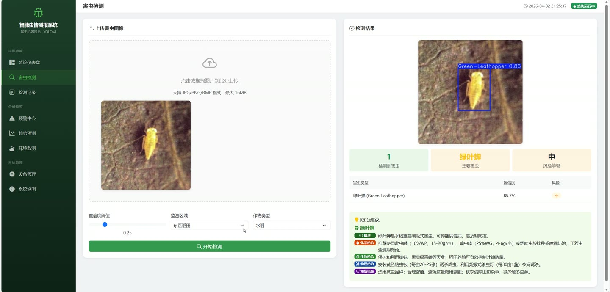
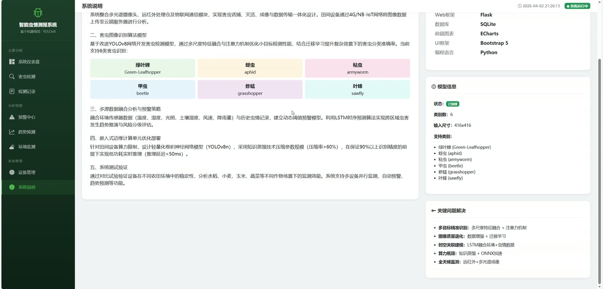
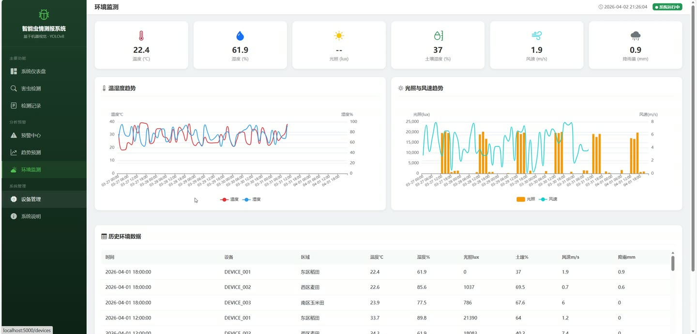
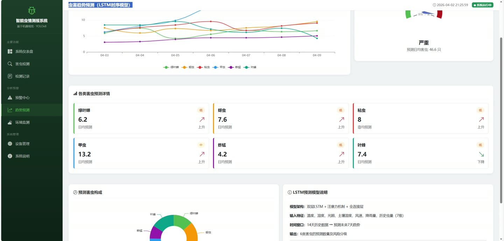

# (附文档)Python+YOLO+深度学习 基于机器视觉的智能虫情测报系统

**技术栈**：Python、Flask、PyTorch、YOLO、深度学习

### 系统简介

本系统是基于机器视觉的智能虫情测报平台，采用 Flask 后端与前端页面分离的架构，集成 YOLO 目标检测与 LSTM 趋势预测模型，实现对农田害虫的自动识别、计数、风险分级、预警推送与趋势预测。系统包含普通用户端与管理员端两类角色，覆盖图像检测、记录管理、预警处置、环境监测与设备管理全流程。
 
### 核心功能
 
### 普通用户端

 
- 上传害虫图像进行检测，支持 png、jpg、jpeg、bmp、gif 格式，单文件不超过 16MB。 
- 自定义检测置信度阈值，默认 0.25，可调节检测灵敏度。 
- 选择检测设备编号、所属区域与作物类型，用于记录归档与区域统计。 
- 查看检测结果图与原始图对比，结果图标注每个害虫的类别与置信度。 
- 查看害虫分类计数结果，系统按绿叶蝉、蚜虫、粘虫、甲虫、蚱蜢、叶蜂六类分别统计数量。 
- 查看主要害虫中文名称、总数量与整体风险等级，风险等级分为安全、低、中、高、严重五档。 
- 查看防治建议详情，包含化学防治、生物防治、物理防治与预防措施四类具体方案。 
- 浏览检测记录列表，支持按害虫类型与区域筛选，分页查看历史检测数据。 
- 查看单条检测记录详情，包含检测时间、置信度、害虫数量、风险等级与防治建议。 
- 查看仪表盘统计，包括总检测数、今日检测数、害虫总数与活跃预警数。 
- 查看近 7 天害虫数量趋势折线数据与风险等级分布统计。 
- 查看各类害虫累计数量排行，掌握主要虫害构成。 
- 查看 7 天虫害趋势预测结果，由 LSTM 模型基于历史数据生成。 
- 查看环境监测数据，包括温度、湿度、光照强度、土壤湿度、风速与降雨量。 
- 按时间范围与设备编号筛选环境数据，默认查询近 24 小时记录。 
- 查看设备列表，了解各测报灯的设备编号、名称、区域、作物类型与在线状态。
 
### 管理员端

 
- 查看全部预警记录列表，支持按活跃与已解除状态筛选，分页展示。 
- 查看预警详情，包含预警区域、害虫类型、预警等级、害虫数量与描述信息。 
- 执行预警解除操作，系统自动记录解除时间并更新预警状态。 
- 新增设备信息，录入设备编号、设备名称、所属区域、作物类型、经纬度坐标。 
- 查看设备在线状态统计，掌握在线设备数与设备总数。 
- 查看 YOLO 模型信息，包括模型路径、类别数量与支持的害虫类别列表。 
- 查看仪表盘全局统计，掌握系统整体检测量与虫情态势。 
- 查看系统说明页面，了解系统功能与模型配置。
 
### 技术栈

 后端框架Flask ORMFlask-SQLAlchemy 深度学习框架PyTorch 目标检测模型YOLO（YOLOv8，含 lite 轻量版） 时序预测模型LSTM 数据库SQLite 图像处理OpenCV / Pillow 前端模板Jinja2 模板引擎 数据可视化ECharts 图表 文件上传Werkzeug secure_filename 开发语言Python
 
### 交付内容

 
- 后端完整源码 
- 前端完整源码 
- 数据库初始化脚本 
- 万字文档

## 界面展示

---

## 获取完整源码 + 万字文档

本仓库为项目介绍页。**完整前后端源码、数据库初始化脚本、万字项目文档**，请加微信 `kangkangcode`，或访问 [codekk.top](http://codekk.top) 获取。

可作课程设计 / 毕业设计参考，支持远程部署调试。